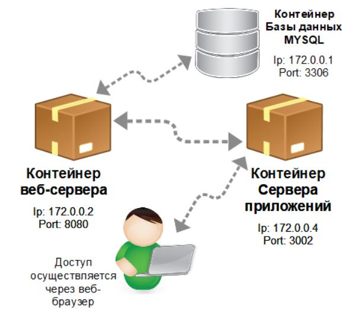
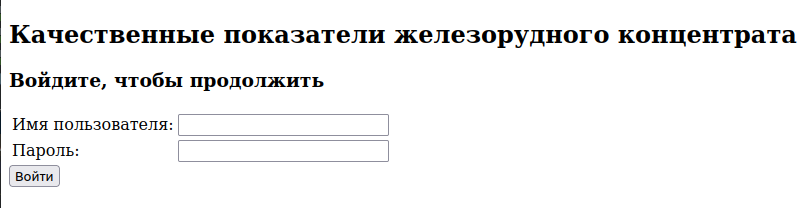
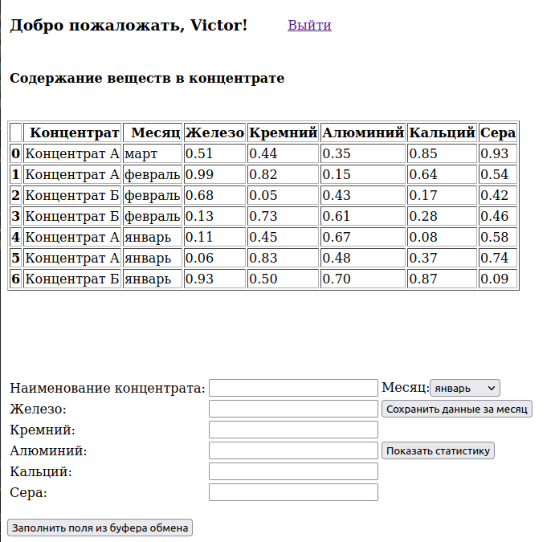
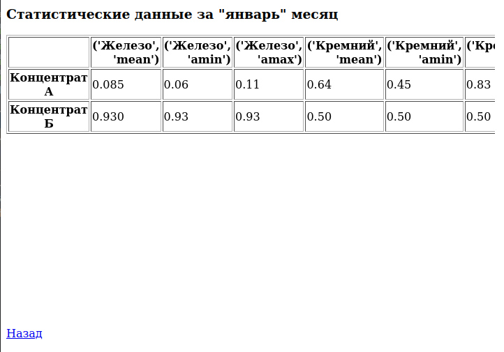

# Качественные показатели железорудного концентрата - клиентская часть приложения.

В данном репозитории содержатся файлы, относящиеся к клиентской части приложения. Для её функционирования необходимо, 
чтобы на компьютере был развёрнут контейнер веб-сервера (второй репозиторий из этой серии) и контейнер базы данных MYSQL,
содержащий базу данных TestDB.

Схема приложения представлена на рисунке ниже:

## Перечень используемого ПО
- язык программирования Python
- docker
- Flask
- PyMySQL
- pandas и пр.

## Структура базы данных
База данных представлена двумя таблицами: *Users* и *lab_info*.
В первой хранятся данные о логинах и паролях пользователей.
Во второй хранятся данные о качественных показателях железорудных концентратов в привязке к user_id, а также с 
учётом месяца.
##### Поля таблицы Users
- *idUsers* - автоинкрементируемое поле
- *user_name* - имя пользователя
- *user_password* - пароль пользователя
##### Поля таблицы lab_info
- *lab_rec_id* - автоинкрементируемое поле
- *user_id* - код пользователя (внешний ключ)
- *concentrate_title* - наименование концентрата
- *month_title* - наименование месяца
- *ferum* - содержание железа
- *cremnium* - содержание кремния
- *aluminium* - содержание алюминия
- *calcium* - содержание кальция
- *sera* - содержание серы.

## Перечень адресов для доступа к функционалу приложения
- **Авторизация пользователя**: http://host:post/login
- **Просмотр данных качественных показателей**: http://host:port/display_all_data

### Страница авторизации

При нажатии на кнопку **Войти**, осуществляется переход на страницу с отображением
информации о содержании веществ в железорудном концентрате (см. рис. ниже).

### Страница отображения качественных показателей

Таблица входит в блок div и при превышении её содержимого размеров этого блока, у блока div появятся полосы прокрутки.
При нажатии на кнопку **Показать статистику**, осуществляется загрузка страницы с результатом
запроса к серверу (см. рисунок ниже). При нажатии кнопки **Сохранить данные за месяц**,
осуществляется отправка запроса на сервер по добавлению данных в БД (передаётся выбранный
на странице месяц, наименование концентрата и качественные показатели оного), страница
обновляется и добавленная запись отображается в таблице.

### Страница отображения сводной информации по концентратам

Таблица с информацией по концентратам входит в блок div, и он имеет полосу прокрутки в нижней своей части.

